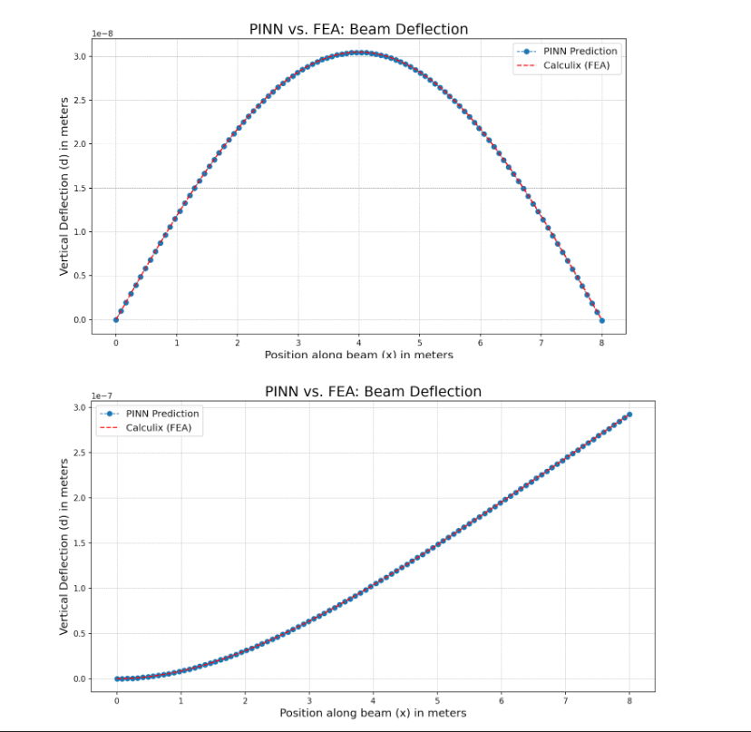

1. PROJECT OVERVIEW

This project implements a Physics-Informed Neural Network (PINN) to solve the Euler–Bernoulli beam equation for two classical structural cases:

• Simply Supported Beam  
 • Cantilever Beam

The model predictions are validated against Finite Element Analysis (FEA) results obtained using CalculiX. The results demonstrate strong agreement between physics-based neural network predictions and numerical simulation.

---

2. OBJECTIVES

The primary objectives of this project are:

• To solve beam bending problems using a physics-based neural network.  
 • To enforce the governing differential equation directly within the loss function.  
 • To correctly implement boundary conditions for both simply supported and cantilever beams.  
 • To compare PINN predictions with FEA results.  
 • To demonstrate the reliability and accuracy of PINNs in structural mechanics applications.

---

3. GOVERNING EQUATION

The Euler–Bernoulli beam equation is given by:

EI (d⁴w/dx⁴) \= q(x)

Where:

E \= Young’s Modulus  
 I \= Moment of Inertia  
 w(x) \= Vertical deflection  
 q(x) \= Distributed load  
 x \= Position along the beam

In this project, the neural network approximates the deflection function w(x). Automatic differentiation is used to compute derivatives up to fourth order, enabling direct enforcement of the governing equation.

---

4. BOUNDARY CONDITIONS IMPLEMENTED

A. Simply Supported Beam

The following boundary conditions are enforced:

w(0) \= 0  
 w(L) \= 0  
 d²w/dx² (0) \= 0  
 d²w/dx² (L) \= 0

This produces:

• A symmetric deflection curve  
 • Maximum deflection at mid-span

---

B. Cantilever Beam

The following boundary conditions are enforced:

w(0) \= 0  
 dw/dx (0) \= 0  
 d²w/dx² (L) \= 0  
 d³w/dx³ (L) \= 0

This produces:

• A monotonic increasing deflection profile  
 • Maximum deflection at the free end

---

5. LOSS FUNCTION STRUCTURE

The total loss function used for training consists of three components:

Total Loss \= PDE Loss \+ Boundary Condition Loss \+ Data Loss

Where:

PDE Loss ensures the governing equation residual is minimized.  
 Boundary Condition Loss enforces physical constraints at beam ends.  
 Data Loss (optional) incorporates supervised FEA data for validation.

---

6. MODEL VALIDATION

Two validation cases are presented:

Case 1: Simply Supported Beam  
 • Symmetric deflection curve  
 • Peak deflection at mid-span  
 • Excellent agreement between PINN and FEA

Case 2: Cantilever Beam  
 • Increasing deflection toward the free end  
 • Maximum deflection at beam tip  
 • Strong overlap between PINN and FEA predictions

Observations:

• Very low prediction error  
 • Smooth and physically consistent curves  
 • Accurate capture of curvature and boundary behavior

 

  

